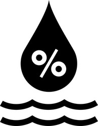

# Weather App
A Weather App allows users to search for the current weather conditions of any city using the OpenWeatherMap API. It provides real-time information such as temperature, humidity, wind speed, and displays weather icons based on conditions (e.g., cloudy, rainy, or clear). 

## This is a basic HTML structure for a weather application using the OpenWeatherMap API
1. HTML Structure:<br>
The structure includes a search box where users can input a city name and get weather data.
It displays weather information such as the city name, temperature, humidity, and wind speed.
Error handling is done for invalid city names, where an error message is shown if the city isn't found.
2. Key Components:<br>
  a. input: The text box where users can enter a city name.<br>
  b. button: Triggers the weather data search.<br>
  c. div class="error": Displays when the user inputs an invalid city name.<br>
  d. div class="weather": Displays weather details such as temperature, city name, humidity, wind speed, and a weather icon based on conditions.
3. CSS Reference:<br>
link rel="stylesheet" href="style.css": Links to an external CSS file for styling.
  
## JavaScript:
The script uses fetch to retrieve weather data from the OpenWeatherMap API using the city name.
It dynamically updates the webpage with the weather information based on the city searched.
Weather icons change based on weather conditions (cloudy, clear, rain, etc.).
1. Key Functions:
checkWeather(city): Fetches the weather data for the input city and updates the UI accordingly. If the city is invalid, it shows an error message.
The app handles five weather conditions: Clouds, Clear, Drizzle, Mist, and Rain.

## CSS:

1.Responsive Design:<br>
The card element is constrained to 90% width and a maximum width of 470px, which should look good on most screens.<br>
Flexbox is used effectively in .search, .details, and .col for aligning items, which should ensure a flexible layout.<br>
2. Gradients and Color Scheme:<br>
The background and card gradients add a nice visual appeal.<br>
The combination of dark blue to red for the body and the blue-green gradient for the card will give a modern and vibrant look.<br>
3. Typography:<br>
Font sizes for temperature (h1) and city name (h2) are large, which makes them stand out.
The 27px font size for .humidity and .wind also seems appropriate for readability.<br>
4. Weather Icon Size:<br>
The weather icon is given a width of 150px, which should look good in the overall layout.
<br>


Code
```
<!DOCTYPE html>
<html lang="en">
  <head>
    <meta charset="UTF-8" />
    <meta name="viewport" content="width=device-width, initial-scale=1.0" />
    <title>Weather App</title>
    <link rel="stylesheet" href="styles.css" />
  </head>

  <body>
    <div class="card">
      <div class="search">
        <input type="text" placeholder="Enter a city name" spellcheck="false" />
        <button>
          
        </button>
      </div>
      <div class="error">
        <p>Invalid city name</p>
      </div>
      <div class="weather">
        
        <h1 class="temp">22°c</h1>
        <h2 class="city">Pokhara</h2>
        <div class="details">
          <div class="col" id="humid">
            
            <div>
              <p class="humidity">50%</p>
              <p>Humidity</p>
            </div>
            <div class="col" id="wind">
              
              <div>
                <p class="wind">15 km per hour</p>
                <p>Wind Speed</p>
              </div>
            </div>
          </div>
        </div>
      </div>
    </div>
    <script>
      const apiKey = "c8b5bf5e872bded465baf0441653a54f";
      const apiUrl =
        "https://api.openweathermap.org/data/2.5/weather?&units=metric&q=";

      const searchBox = document.querySelector(".search input");
      const searchBtn = document.querySelector(".search button");
      const weatherIcon = document.querySelector(".weather-icon");
      async function checkWeather(city) {
        const response = await fetch(apiUrl + city + `&appid=${apiKey}`);

        if (response.status == 404) {
          document.querySelector(".error").style.display = "block";
          document.querySelector(".weather").style.display = "none";
        } else {
          var data = await response.json();

          document.querySelector(".city").innerHTML = data.name;
          document.querySelector(".humidity").innerHTML =
            data.main.humidity + "%";
          document.querySelector(".wind").innerHTML =
            data.wind.speed + " km/hr";

          if (data.weather[0].main == "Clouds") {
            weatherIcon.src = "img/cloud.webp";
          } else if (data.weather[0].main == "Clear") {
            weatherIcon.src = "img/clear.png";
          } else if (data.weather[0].main == "Drizzle") {
            weatherIcon.src = "img/drizzle.webp";
          } else if (data.weather[0].main == "Mist") {
            weatherIcon.src = "img/Mist.png";
          } else if (data.weather[0].main == "Rain") {
            weatherIcon.src = "img/rain.png";
          }

          document.querySelector(".weather").style.display = "block";
          document.querySelector(".error").style.display = "none";
        }
      }
      searchBtn.addEventListener("click", () => {
        checkWeather(searchBox.value);
      });
    </script>
  </body>
</html>

```

```
* {
  margin: 0;
  padding: 0;
  box-sizing: border-box;
}

body {
  background: linear-gradient(90deg, rgb(3, 22, 116) 0%, rgb(103, 2, 22) 100%);
}

.card {
  width: 90%;
  max-width: 470px;
  background: linear-gradient(135deg, #00feba, #5b548a);
  color: #fff;
  margin: 100px auto 0;
  border-radius: 20px;
  padding: 40px 35px;
  text-align: center;
}

.search {
  width: 100%;
  display: flex;
  align-items: center;
  justify-content: space-between;
}

.search input {
  border: 0;
  outline: 0;
  background: #ebfffc;
  color: black;
  padding: 10px 25px;
  height: 60px;
  border-radius: 30px;
  flex: 1;
  margin-right: 16px;
  font-size: 18px;
}

.search button {
  border: 0;
  outline: 0;
  background: #ebfffc;
  border-radius: 50%;
  width: 60px;
  height: 60px;
  cursor: pointer;
}

.search button img {
  width: 40px;
}

.weather-icon {
  width: 150px;
  margin-top: 30px;
}

.weather h1 {
  font-size: 80px;
  font-weight: 500;
}

.weather h2 {
  font-size: 45px;
  font-weight: 400;
  margin-top: -10px;
}

.details {
  display: flex;
  align-items: center;
  justify-content: space-evenly;
  padding: 0 20px;
  margin-top: 50px;
  text-align: left;
}

.col {
  display: flex;
  align-items: center;
  justify-content: space-between;
}

.col img {
  width: 60px;
  margin-right: 10px;
}

#wind {
  margin-left: 60px;
}

.humidity,
.wind {
  font-size: 27px;
}

.weather {
  display: none;
}

.error {
  text-align: left;
  margin-left: 10px;
  margin-top: 10px;
  display: none;
}

```
